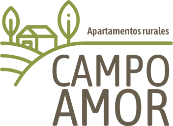

# CAMPO AMOR

## ¿Qué es este repositorio?
Este repositorio es el primer proyecto de React para la asignatura de desarrollo de interfaces donde he tenido que diseñar una aplicación en Figma siguiendo una serie de requisitos para posteriormente materializar dicho diseño en código.

El proyecto utiliza **Vite** como herramienta. Incluye *Router* y *Link* para la navegación.

## Requisitos funcionales

1. Secciones de la Aplicación:
    + Inicio
        + Imagen.
        + Nombre del apartamento.
        + Ubicación.
        + Precio por noche.
        + Botón para ver más detalles.

    + Ayuda
    + Dejar un comentario
        + Nombre del usuario.
        + Correo electrónico.
        + Texto del comentario.

2. Detalle del Apartamento:
    
    Al hacer click en "Ver más" se abre una nueva vista con la siguiente información:

    + Imagen destacada del apartamento.
    + Nombre y ubicación.
    + Descripción completa.
    + Lista de servicios.
    + Precio por noche.
    + Botón para volver a la sección de inicio.

3. Menú de navegación inferior

    Menú de navegación *sticky* en la parte inferior que permita cambiar entre las secciones:

    + Inicio.
    + Ayuda.
    + Deja un Comentario.

## Requisitos técnicos
+ Usar **Bootstrap** para el diseño.
+ Implementar un diseño atractivo y limpio, con un enfoque en la usabilidad.
+ Asegurar que el diseño sea completamente funcional en dispositivos móviles.
+ Implementar la navegación entre secciones usando **react-router-dom**.
+ Validación de formulario no necesaria.
